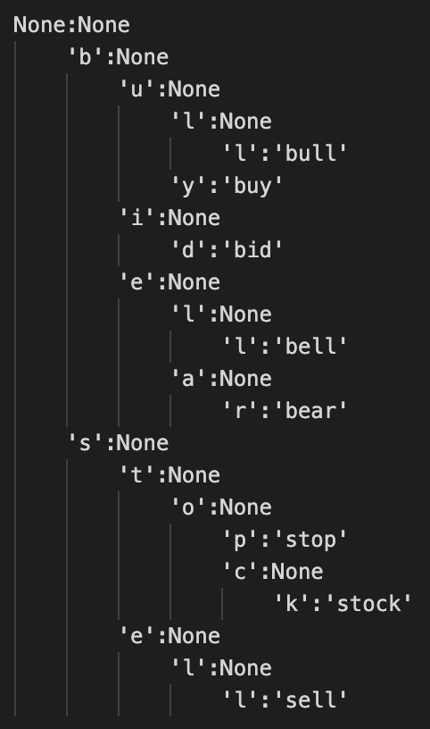
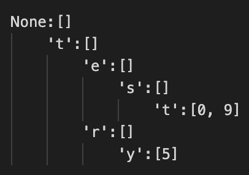

## 1. Spell checking(without trie)

Write a spell-checker class that stores a lexicon of words `lexicon`, in a
Python `set`, and implements a method, `check(word)`, which performs a spell check
on the string `word` with respect to the words in `lexicon`. 

If `word` is in `lexicon`, then the call to `check(word)` should return a list containing
only `word`, as it is assumed to be spelled correctly in this case.

If `word` is not in `lexicon`, then the call to `check(word)` should return a list of every
word in `lexicon` that might be a correct spelling of `word`. Your program should
be able to handle common ways that `word` might be a misspelling of a word in
`lexicon`: inserting a single character in between two adjacent characters in a
word, deleting a single character from a word, and replacing a single character
in a word with another character. Your implementation should be based on the
minimum edit distance algorithm.

The directory `spell_checker` contains the starter code for this problem. Your
task is to complete the`SpellChecker` class by filling in its constructor,
`__init__()`, and the `check()` method.

A test suite for `SpellChecker` is also available in `test_spell_checker.py`. The
tests create a spell checker using a custom 
[aspell US English dictionary](http://app.aspell.net/create) containing 50,166 unique words. 

The test data comes from [Roger Mitton's Birkbeck spelling error
corpus](https://ota.bodleian.ox.ac.uk/repository/xmlui/handle/20.500.12024/0643),
file `TELEMARKDAT.643`. As detailed in `AAAREADMEDOC.643`, the data comes from a
study by Nils Rottingen, 'A  typology  of grammatical and orthographic errors
made by advanced  Norwegian  learners  of  English  as  a  foreign  language',
published by Telemark College, N-3800 Bo, Norway (ISBN 82-7206-095-7). It
contains misspells done by students in writing English essays. Each line
contains one error - first the misspelled word, then the correct word.
Additionally, a number might follow, indicating how many times that particular
misspelling has occurred in the study. The file contains a total of 1084
misspelled words. 

A sample of 50 words have been randomly chosen to serve as
test words for this exercise - `TELEMARKDAT_sample.643`.

Implement the methods of the `SpellChecker` class as detailed above such that
all the tests in `test_spell_checker.py` pass. You can run these tests from the commandline using
`python3 -m unittest spell_checker.test_spell_checker`.

## 2. A standard trie class

The lexicon of a spell checker can also be represented using a standard trie
instead of a set. 

The directory `tries` contains, in `standard_trie.py`, an incomplete
implementation of a standard trie class, `StandardTrie`. It features an internal
class, `Node`, used to represent the nodes of the trie. A node has a `key` and a
`value` attribute, and a dictionary of
child nodes called `children`. The `StandardTrie` constructor builds the trie
by adding, one by one, the strings from a given string collection.

Your task is to complete the `StandardTrie` class with:
- the `add()` method for inserting a (`string`, `value`) pair in the trie, 
- the `find()` method for finding the `value` associated with a `string` pattern.

Your goal is to implement a trie which can be used to store a lexicon, so you
should test your implementation using a small set of words (you could
use examples from the lecture slides - `{bear, bell, bid, bull, buy, sell,`
`stock, stop}`). Write tests for the `StandardTrie` class separately, in a file
called `test_standard_trie.py`, using Python's `unittest` framework.

You do not need to use a `$` symbol for this implementation - if you
add the full string as a value only to the nodes that have as key the last character of
the string.

To help with debugging, the starter code includes code for printing the contents
of a trie. A call to `print(trie)` will pretty-print the nodes and values in the
trie using tab-based level indentation.

A standard trie for the example above looks like this:

## 3. Spell checking with tries

The spell checker implemented at problem 1 is not very
efficient in terms of the time required to find the list of possible spellings
for a word given a particular lexicon.

We can make the search more efficient by using a trie instead of a set to
represent the lexicon. Implement a new class, `TrieSpellChecker`, similar to the
`SpellChecker` class from problem 1.

The new class implements the same interface as before:

- `__init__(self, lexicon)`, for storing the lexicon as an attribute of the spell-checker - using
 a standard trie, as implemented at step 2
- `check(self, word)` for finding the spellings of a string `word`

Your `check(word)` function should still be based on the minimum edit distance
algorithm. However, instead of computing the distance between the string `word` and
each word of the trie directly, we will compute the distances incrementally,
according to the letters available in the trie. 

Initially, we will compute the distance between `word` and each of the first letters
in the trie. 

E.g. if `word` = `bell` and the root node of the trie has two child nodes with keys `b`
and `s`, then compute the min edit distance twice: once between `b` and `bell`
and once between `s` and `bell`. When using the variant of the Levenshtein
distance where insertion, deletion and substitution all have a cost of 1, the
minimum value on the `b` row of `D(b, bell)` will be 0, and the minimum on the `s` row
of `D(s, bell)` will be 1.

As long as the letters we have encountered so far form a word that has a minimum
edit distance <= 1 from the `word` we are searching for, we can continue filling
in the tables corresponding to each current path recursively for each of the
child nodes. In the example this means continuing building the tables for the
path starting with `b` and for the path starting with `s`.

__Note that at any one point we will only require information from the last row
of the table D of the parent node to be able to compute the next row of D for
each of the child nodes.__

Such an algorithm immediately discards the paths in the trie that do not lead to
good solutions - e.g. in the example trie formed from `{bear, bell, bid, bull, buy, sell,`
`stock, stop}` we would continue with 3 nodes after `b` (`e`, `i`, `u`) and with two nodes after
`s` (`e`, `t`). However, for the nodes after `s` we would already have a minimum
edit distance of 2 - for `se` and `st`, so the search would be stopped on these
branches. The search would continue on the other branches `be`(0), `bi`(1),
`bu`(1). 

The branches that lead to possible spellings of `s` will have a value <= 1 on
the last column of the current row. This means that path matched the searched
`word` almost completely - other than a deletion, substitution or insertion.

You are provided with tests for the new class in `test_trie_spell_checker.py`.
Note that the new implementation should run significantly faster than the
previous one, such that corrections for the 1084 misspelled words in `TELEMARKDAT.643`
should be computed very fast.

## 4. Keyword in Context Interface (KWIC)

Build an interface for visualizing keywords in context using tries. The
code in the `kwic` directory should serve as the starting point. 

As a first step, you need to modify the standard trie from exercise 2 such that for
each word in a text it saves as a value a list of start indices where the
word appears in the text. 

For example the text `test try test!` should be represented by the following
trie:

When adding words to the trie you should strip any punctuation that occurs at
the end of individual words in the text. You should not, however, remove the
punctuation or any stop words from the original text. 

You do not need to use a `$` symbol for this implementation -  if you only add
values to the list for words that appear in your text.

You can reuse much of the `StandardTrie` implementation - so you are provided
with the skeleton of the `WordMatchingTrie` class which inherits from
`StandardTrie`. You only need to update the constructor of the class, the
`add()` method and the constructor of the nested `Node` class.

The tests in `test_word_matching_trie.py` should help ensure that your new
implementation works as expected.

In a second step, you are asked to print up to `max_count` occurrences of a
keyword in a text, and up to `window_sz` characters to the left and up to `window_sz`
to the right of the keyword. Make sure to remove any newlines from the text -
this will ensure that the contexts are displayed in a consistent way. 

Also, to make it easier to spot the keyword, you should separate it from the
preceding and succeeding context with four spaces. In cases where the contexts are
smaller than `window_sz` you should right-justify the preceding context and
left-justify the succeeding context, by padding them with spaces as needed.

`kwic.py` is a script which asks for a file to search for, a window size and a
max count, and proceeds to query the text for the keyword. If the word is part
of the text, it should print the `args.max_count` contexts for the word.
Otherwise, it should print a message informing the  user that the word
was not found in the text.
__The program should keep asking for a new keyword until the user terminates the
loop by presses enter without inputting any characters.__

By default the script will search through Herman Melville's "Moby Dick" text,
provided in `kwic/data/2701-0.txt`, but you can change the text via the arguments.

Your task is to extend `kwic.py` and add support for finding a keyword and its
context using the `WordMatchingTrie`.

You can run the kwic interface using the command `python3 -m kwic.kwic`.

